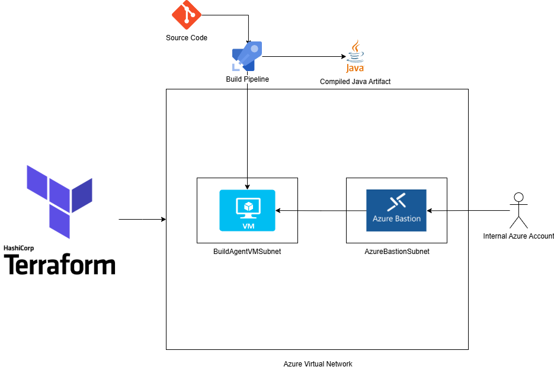
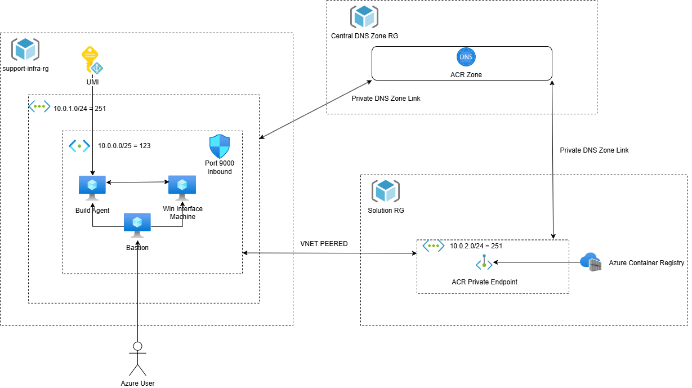
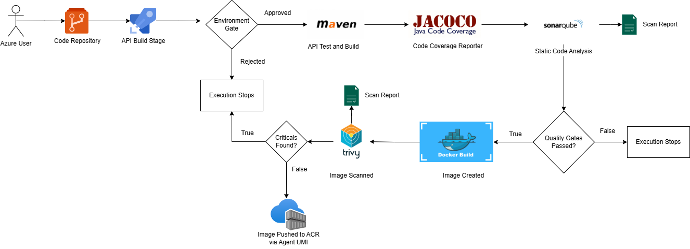

# Cloud Portfolio

Welcome to my cloud portfolio!

This repository will contain Terraform and various yaml files to showcase different solutions build on Azure and Azure Devops!

# Project One - IaC Provisioned Linux Build Agent

## Description
Provisioning a linux build agent through Terraform

## Purpose
I have noticed that my previous Azure Build Agent, which was provisioned via the Azure CLI, was still incurring costs for the storage it used, although it was deallocated.

Additionally, tearing down this VM and recreating it was a hassle.

Terraform helps address these issues by allowing me to easily provision and deprovision resources, while ensuring the same state through idempotency.

## Diagram

## Infra Components
1. Resource Group - Houses all Azure Infrastucture
2. Virtual Network - Ground Zero for all networking components
3. Subnets - Consists of a BastionSubnet and a subnet for the Build Agent's NIC
4. Linux Virtual Machine - The Build Agent VM with no Public IP
5. Bastion - For secure SSH to the build agent by an internal Azure user
6. Shell Script - Responsible for installing the Build Agent Software and all tooling (Java, Maven, Docker, Helm, Kubectl, Trivy)

# Project Two - DevSecOps API Delivery

## Description
Provisioning Azure Cloud Infrastructure and supporting AZDO Pipelines for API Building, Testing, Containerizing and Storing.

## Purpose
This second project aims to showcase working knowledge of Azure IaaS and PaaS to faciliate a platform where developers can build, test and house reliable Java APIs.

## Lessons Learned

This project taught me the writing IaC Code in a scalable fashion so that new components and basically plug and play.

Additionally, the importance good networking skills was made very clear. This led to a deeper investigation into Private Endpoints, Virtual Network Links, NSGs, DNS Zones and DNS Zone Links.

As it relates to the CI/CD processes, templating code has been extremely useful. This led to multiple APIs being able to utilize the same templates for the building, scanning and pushing of code/images.

Finally, configuring SonarQube and Trivy was also fruitful. Witnessing the scans and having to remediate code was rewarding and also insightful as to how to pinpoint critical vulnerabilities and execute remediation.

## Diagram

## Infra Components
1. Resource Group - Logically grouping Infrastructure Services
2. Virtual Network & Subnets - Ground Zero for all networking components for each component of the overall infrastructure/platform deliverable.
3. Private DNS Zones - Provides a reliable and secure DNS service to manage and resolve 
domain names within a virtual network without the need for a custom DNS solution.
4. Private Endpoints - Allowing secure access to Azure Resources without going out to the internet.
5. NSGs & NSG Rules - Allows for internal secure connectivity to Virtual Machines and the applications running on them.
6. Linux Virtual Machine - The Build Agent VM with no Public IP
7. Windows Virtual Machine - Providing access to the SonarQube UI.
8. Bastion - For secure SSH/RDP to the Linux or Windows Virtual Machines
9. Azure Container Registry - A managed registry service based on the open-source Docker Registry 2.0
10. User Managed Identity - Azure's approach for managing credentials for applications without embedding them in the code
9. Shell Script - Responsible for installing the Build Agent Software and all tooling (Java, Maven, Docker, Helm, Kubectl, Trivy)

## Diagram

## Azure DevOps Components

1. YAML Templates - Allows us to write usable code across pipelines.
2. YAML Pipelines - Logic which helps us automate CI/CD processes.
3. Environments - Collections of resources that can be targeted with deployments from a pipeline.
4. Variable Groups - Houses data to be consumed by pipelines.