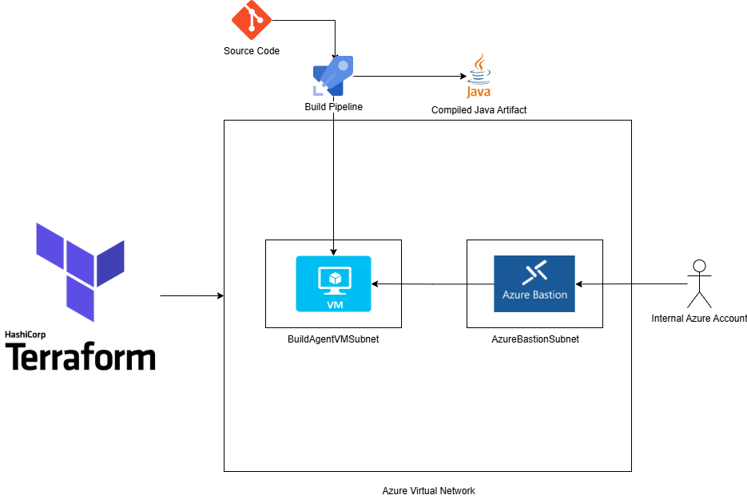

# Cloud Portfolio

Welcome to my cloud portfolio!

This repository will contain Terraform and various yaml files to showcase different solutions build on Azure and Azure Devops!

# Project One - IaC Provisioned Linux Build Agent

## Description
Provisioning a linux build agent through Terraform

## Purpose
I have noticed that my previous Azure Build Agent, which was provisioned via the Azure CLI, was still incurring costs for the storage it used, although it was deallocated.

Additionally, tearing down this VM and recreating it was a hassle.

Terraform helps address these issues by allowing me to easily provision and deprovision resources, while ensuring the same state through idempotency.

## Diagram

## Infra Components
1. Resource Group - Houses all Azure Infrastucture
2. Virtual Network - Ground Zero for all networking components
3. Subnets - Consists of a BastionSubnet and a subnet for the Build Agent's NIC
4. Linux Virtual Machine - The Build Agent VM with no Public IP
5. Bastion - For secure SSH to the build agent by an internal Azure user
6. Shell Script - Responsible for installing the Build Agent Software and all tooling (Java, Maven, Docker, Helm, Kubectl, Trivy)

